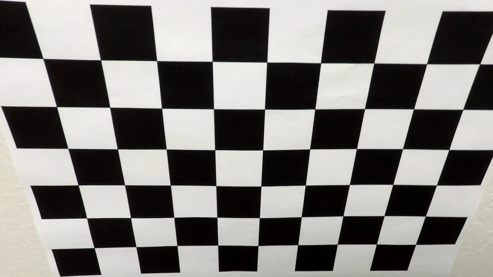

# Advanced Lane Finding Project

The goals / steps of this project are the following:

* Compute the camera calibration matrix and distortion coefficients given a set of chessboard images.
* Apply a distortion correction to raw images.
* Use color transforms, gradients, etc., to create a thresholded binary image.
* Apply a perspective transform to rectify binary image ("birds-eye view").
* Detect lane pixels and fit to find the lane boundary.
* Determine the curvature of the lane and vehicle position with respect to center.
* Warp the detected lane boundaries back onto the original image.
* Output visual display of the lane boundaries and numerical estimation of lane curvature and vehicle position.

## Camera Calibration

Camera calibration functions are implemented in file [src/camera_calibration.py](./src/camera_calibration.py) based on the concepts described in [OpenCV Camera Calibration Tutorial](https://docs.opencv.org/3.0-beta/doc/py_tutorials/py_calib3d/py_calibration/py_calibration.html).

Basically, the lens of a camera introduces two types of distortion.
* **Radial Distorion:** which causes straight lines to appear curved.
* **Tangential Distortion** which causes some areas in the image to look nearer than they really are.

OpenCV provides the following APIs to help in Camera Lens Distorion correction which are used in [src/camera_calibration.py](./src/camera_calibration.py) to achieve Camera Calibration:
* `cv2.findChessboardCorners()`: Used to find intersection points in a chessboard figure.
* `cv2.drawChessboardCorners()`: Can be used to draw the points extracted by `cv2.findChessboardCorners()` on the original image (For debugging purposes).
* `cv2.calibrateCamera()`: Generates the *Camera Matrix* and *Distortion Coefficients* that can be used to correct Camera Lens Distortion for any image taken by the same camera.
* `cv2.undistort()`: Performs Camera Lens Distortion Correction for an image using the *Camera Matrix* and *Distortion Coefficients* of the used camera.

Examples for distortion corrected images can be found in [camera_cal/undistorted](./camera_cal/undistorted)

| Image |Original Image             |  Undistored Image        |
|:-:|:-------------------------:|:-------------------------:
|calibration2.jpg|  |  
|calibration3.jpg|  |  
|calibration12.jpg|  |  

## Image Preprocessing Pipeline

The Image preprocessing pipeline is defined in [src/pipeline.py](./src/pipeline.py) in the following function

```python
def preprocess_input_image(image):
    # 1. Apply perspective transformation to remove the effect of Camera Lens Distorion
    undistorted_image = undistort(image)
    
    # 2. Convert to HLS color space and separate the S channel
    hls = cv2.cvtColor(undistorted_image, cv2.COLOR_RGB2HLS)
    s_channel = hls[:,:,2]
    
    # 3. Perform histogram equalization on S Channel
    s_channel_hist_equalized = cv2.equalizeHist(s_channel)
    
    # 4. Apply thresholding on S Channel (Normalized)
    s_channel_binary = np.zeros_like(s_channel_hist_equalized)
    s_channel_binary[(s_channel_hist_equalized>=PREPROCESSING_S_CHANNEL_THRESHOLD)] = 1
    
    # 5. Apply magnitude and direction thresholds on S Channel (Normalized)
    mag_dir_binary = sobel_mag_dir_threshold(s_channel_hist_equalized, sobel_kernel=PREPROCESSING_SOBEL_KERNEL_SIZE, mag_thresh=PREPROCESSING_SOBEL_MAGNITUDE_THRESHOLD, dir_thresh=PREPROCESSING_SOBEL_DIRECTION_THRESHOLD)
    
    # 6. Combine S Channel and Sobel binary images
    binary_thresh_image = np.zeros_like(s_channel_binary)
    binary_thresh_image[(mag_dir_binary == 1) | (s_channel_binary == 1)] = 1
    
    # 7. Perform perspective transformation to a 'Bird's Eye' view required by Lane Detection pipeline
    preprocessed_image  = transform_perspective(binary_thresh_image)
    
    return preprocessed_image, undistorted_image
```

Below is the output of different stages of the Image preprocessing pipeline


The pipeline consists of the following stages:

1. **Camera Lens Distortion Correction**<br>
	Using the precalculated *Camera Matrix* and *Distortion Coefficients* the original image is corrected for lens distortion.
	This function is implemented in [src/pipeline.py](./src/pipeline.py)
```python
def undistort(image):
    global camera_mtx, camera_dist
	
	# if camera calibration parameters are not yet loaded, load them
    if (camera_mtx is None) or (camera_dist is None):
        camera_calib = pickle.load(open(CAMERA_CALIBRATION_MATRIX_FILE, "rb"))
        camera_mtx = camera_calib["mtx"]
        camera_dist = camera_calib["dist"]
    assert ((camera_mtx is not None) and (camera_dist is not None)), "Camera Calibration Parameters not available"
    
	# Apply Camera Lens Distortion Correction
    undistorted_image = cv2.undistort(image, camera_mtx, camera_dist)
    return undistorted_image
```

1. **Color Space Transform**<br>
	The image is transformed to the HLS color space and the Saturation channel is separated.<br>
	The Saturation channel is chosen because the lanes appear very clear and the background (road) is of very low saturation

1. **Normalization**<br>
	Histogram equalization is applied to increase the image contrast in low light or shadow conditions

1. **Sobel Transform**<br>
	Sobel Edge detection is applied to the Histogram Equalized Image in the S channel to detect edges of lane lines.
	The implementation of this functionality in [src/pipeline.py](./src/pipeline.py) is described in the code comments
```python
def sobel_mag_dir_threshold(grayscale_image, sobel_kernel=3, mag_thresh=(0, 255), dir_thresh=(0, np.pi/2)):
    # Apply the following steps to img
    # 1) Take the gradient in x and y separately
    sobel_x = cv2.Sobel(grayscale_image, cv2.CV_64F, 1, 0, ksize=sobel_kernel)
    sobel_y = cv2.Sobel(grayscale_image, cv2.CV_64F, 0, 1, ksize=sobel_kernel)
    # 3) Calculate the magnitude
    abs_sobel_xy = np.sqrt(np.power(sobel_x, 2) + np.power(sobel_y, 2))
    # 4) Scale to 8-bit (0 - 255) and convert to type = np.uint8
    scaled_abs_sobel_xy = np.uint8((abs_sobel_xy/np.max(abs_sobel_xy))*255)
    # 5) Take the absolute value of the x and y gradients
    abs_sobel_x = np.absolute(sobel_x)
    abs_sobel_y = np.absolute(sobel_y)
    # 6) Use np.arctan2(abs_sobely, abs_sobelx) to calculate the direction of the gradient 
    sobel_dir = np.arctan2(abs_sobel_y, abs_sobel_x)
    # 5) Create a binary mask where direction thresholds are met
    masked_sobel_dir = np.zeros_like(sobel_dir)
    masked_sobel_dir[
        (sobel_dir >= dir_thresh[0]) & 
        (sobel_dir <= dir_thresh[1]) &
        (scaled_abs_sobel_xy >= mag_thresh[0]) & 
        (scaled_abs_sobel_xy <= mag_thresh[1])
        ] = 1
    # 6) Return this mask as your binary_output image
    binary_output = masked_sobel_dir
    return binary_output
```

1. **Thresholding**<br>
	Thresholds are applied to Sobel Output as well as the S Channel. Thresholded binary images (`mag_dir_binary` and `s_channel_binary`) are combined together.
```python
binary_thresh_image[(mag_dir_binary == 1) | (s_channel_binary == 1)] = 1
```

	Threshold values are declaraed in [src/pipeline.py](./src/pipeline.py)
```python
PREPROCESSING_S_CHANNEL_THRESHOLD       = 230
PREPROCESSING_SOBEL_MAGNITUDE_THRESHOLD = (40, 255)
PREPROCESSING_SOBEL_DIRECTION_THRESHOLD = (np.deg2rad(45), np.deg2rad(90))
PREPROCESSING_SOBEL_KERNEL_SIZE         = 3
```

1. **Perspective Transformation**<br>
	Transformation of the binary image to a Top-Down view is performed as a final step of the Image Preprocessing pipeline.

	

| Source point in original perspective | Destination point in warped perspective |
|:------------------------------------:|:---------------------------------------:|
| (580, 460) | (Image Width * 4, 0) |
| (205, 720) | (Image Width * 4, 0) |
| (1103, 720)| (Image Width * 3 / 4, 0) |
| (704, 460) | (Image Width * 3 / 4, 0) |

```python
def transform_perspective(image):
    global M_perspective_transform
    if M_perspective_transform is None:
        src = np.float32([[580, 460],
                          [205, 720],
                          [1103, 720],
                          [704, 460]])
        dst = np.float32([[image.shape[1] / 4 , 0],   
                          [image.shape[1] / 4,  image.shape[0]],    
                          [image.shape[1] * 3 / 4, image.shape[0]],   
                          [image.shape[1] * 3 / 4, 0]])
        # Get new perspective transformation Matrix
        M_perspective_transform = cv2.getPerspectiveTransform(src, dst)
    assert M_perspective_transform is not None
   
    # Use M_perspective_transform to warp the input image to top-down view
    warped_image = cv2.warpPerspective(image, M_perspective_transform, image.shape[1::-1], flags=cv2.INTER_LINEAR)
    
    return warped_image
```

* 4 Source points are selected manually to cover the most important part of the drivable lane
* 4 Destination points are selected to cover the whole warped image
* OpenCV API `cv2.getPerspectiveTransform()` is used to calculate the transformation matrix, which is stored globally for using on later frames
* OpenCV API `cv2.warpPerspective()` is used to apply the transformation and return a warped "Bird's Eye View" image
* The length of the lane markings and the lane width are measured from the output image and stored in [src/lane.py](./src/lane.py) to be used for later calculations
	```python
	# Assumptions about real length and width of lane markings
	LANE_WIDTH_METRES = 3.7
	LANE_MARKING_LENGTH_METRES = 3.0

	# Measurments of lane marking length and width measured from warped image of a straight lane 
	LANE_WIDTH_PIXELS = 610
	LANE_MARKING_LENGTH_PIXELS = 110
		
	# Define conversions in x and y from pixels space to meters
	M_PER_PIXEL_X = LANE_WIDTH_METRES/LANE_WIDTH_PIXELS # meters per pixel in x dimension
	M_PER_PIXEL_Y = LANE_MARKING_LENGTH_METRES/LANE_MARKING_LENGTH_PIXELS # meters per pixel in y dimension
	```

## Lane Detection

Lane detection functions are implemented [src/lane.py](./src/lane.py).


* The function `fit_lanes_blindscan()` performs the following:
		1. Apply Histogram to the lower half of the binary image
		2. Locate the starting point of the left and right lanes by measuring the histogram maxima in the left and right halves.
		3. Create the first window of each lane and set its center at the previously determined starting point in the x direction.
		4. Determine the number of non-zero points within this window
		5. Move the center of this window to the mean location of all the nonzero points in this window
		6. Create the next higher window with the same center
		7. Go back to step 4 until all the windows are finished
		8. Fit two polynomials using all detected non-zero points in the left lane windows and right lane windows

* The function `fit_lanes_lookahead()`:
	* Uses information from previously detected lanes 
	* Finds non-zero points in a region around the previously detected lane polynomials
	* Fit two polynomials using all detected non-zero points
	
* The function `calculate_curvature()` implements the lane curvature calculation and is based on the sample implementation provided in the project introduction.
```python
def calculate_curvature(self, ref_image, reference_point=None):
	left_lane_poly = self.__left_lane.get_smoothed_lane_poly()
	right_lane_poly = self.__right_lane.get_smoothed_lane_poly()
	
	# Generate some fake data to represent lane-line pixels
	ploty = np.linspace(0, ref_image.shape[0]-1, ref_image.shape[0])
	
	# Fit a second order polynomial to pixel positions in each fake lane line
	left_lane_line = left_lane_poly.evaluate(ploty)
	right_lane_line = right_lane_poly.evaluate(ploty)
	
	# Fit new polynomials to x,y in world space
	left_fit_cr = np.polyfit(ploty*M_PER_PIXEL_Y, left_lane_line*M_PER_PIXEL_X, FIT_LANES_POLYNOMIAL_DEGREE)
	right_fit_cr = np.polyfit(ploty*M_PER_PIXEL_Y, right_lane_line*M_PER_PIXEL_X, FIT_LANES_POLYNOMIAL_DEGREE)
	# Calculate the new radii of curvature
	if reference_point is None:
		reference_point = ref_image.shape[0]
	left_lane_curvature_radius = ((1 + (2*left_fit_cr[0]*reference_point*M_PER_PIXEL_Y + left_fit_cr[1])**2)**1.5) / np.absolute(2*left_fit_cr[0])
	right_lane_curvature_radius = ((1 + (2*right_fit_cr[0]*reference_point*M_PER_PIXEL_Y + right_fit_cr[1])**2)**1.5) / np.absolute(2*right_fit_cr[0])
	
	return (left_lane_curvature_radius + right_lane_curvature_radius)/2
```

* The function `calculate_distance_to_lane_center()` determines the distance to lane center
	* It determines the x coordinate of the lowest point in the left and right lanes
	* The lane center is the median point between the two lane points
	* The car position is assumed to be at the center of the frame
	
```python
def calculate_distance_to_lane_center(self, ref_image):
        
        # Assume that the camera is mounted in the center of the car, so the car is at the center of the frame
        x_car = ref_image.shape[1]//2
        
        # Calculate distance to left lane
        x_left_lane = self.__left_lane.get_smoothed_lane_poly().evaluate(ref_image.shape[0])
        
        # Calculate distance to right lane
        x_right_lane = self.__right_lane.get_smoothed_lane_poly().evaluate(ref_image.shape[0])
        
        lane_center = (x_right_lane - x_left_lane)//2  + x_left_lane
        distance_to_lane_center_px = x_car - lane_center
        return distance_to_lane_center_px*M_PER_PIXEL_X
```

### Lane Detection Pipeline
	
A class `LaneProcessor` is created to handle the Lane Detection Pipeline. The function `process_frame()` is called by the Image Processing Pipeline for each video frame.
* Determines whether to run a Blind Scan or a Lookahead scan
* Performs sanity checks on the detected lanes
* Triggers the calculation of Lane Curvature and Distance to lane center
* returns a smoothed lane polynomial over previous N lane samples to avoid wiggling and missed frames

```python
class LaneProcessor:
    
    def __init__(self):
        self.__right_lane = Lane(LANE_SMOOTHING_NUM_SAMPLES)
        self.__left_lane = Lane(LANE_SMOOTHING_NUM_SAMPLES)
        self.__sample_count = 0
		
	...
	
	def process_frame(self, image):
        
        if (self.__sample_count % FIT_LANES_FORCE_BLINDSCAN_PERIOD) == 0:
            left_lane_poly, right_lane_poly, num_left_lane_points, num_right_lane_points = self.fit_lanes_blindscan(image)            
        else:
            left_lane_poly, right_lane_poly, num_left_lane_points, num_right_lane_points = self.fit_lanes_lookahead(image)
                
        if self.perform_sanity_checks(left_lane_poly, right_lane_poly, num_left_lane_points, num_right_lane_points) == True:
            self.__left_lane.add_lane_sample(left_lane_poly)
            self.__right_lane.add_lane_sample(right_lane_poly)
        
        smoothed_left_lane_poly = self.__left_lane.get_smoothed_lane_poly()
        smoothed_right_lane_poly = self.__right_lane.get_smoothed_lane_poly()
        
        lane_curvature = self.calculate_curvature(image)
        distance_to_lane_center = self.calculate_distance_to_lane_center(image)
        
        self.__sample_count += 1
        
        return smoothed_left_lane_poly, smoothed_right_lane_poly, lane_curvature, distance_to_lane_center
```

## Final Pipeline Output

The complete pipeline is define in `process_frame()` in [src/pipeline.py](./src/pipeline.py).

```python
def process_frame(input_image, frame_number, lane_processor):
    
    # Run the Image Preprocessing Pipeline
    preprocessed_image, undistorted_image = preprocess_input_image(input_image)
    
    # Run the Lane Detection Pipeline
    smoothed_left_lane_poly, smoothed_right_lane_poly, lane_curvature, distance_to_center = lane_processor.process_frame(preprocessed_image)
    
    if (smoothed_left_lane_poly is not None) and (smoothed_right_lane_poly is not None) and (lane_curvature is not None):
        
        # draw lanes on the warped image
        lane_polygon_image = draw_lane(preprocessed_image, smoothed_left_lane_poly, smoothed_right_lane_poly)
        
        # Unwarped the image back to the original perspective
        lane_polygon_image_unwarped = unwarp_image(lane_polygon_image)
        
        # Overlay the lane image and information on the original frame
        output_image = overlay_lane(undistorted_image, lane_polygon_image_unwarped)
        cv2.putText(output_image,'Frame Number: {}'.format(frame_number), (10,30), cv2.FONT_HERSHEY_SIMPLEX, 1,(255,255,255),2,cv2.LINE_AA)
        cv2.putText(output_image,'Lane Curvature: {:.02f}m'.format(lane_curvature), (10,60), cv2.FONT_HERSHEY_SIMPLEX, 1,(255,255,255),2,cv2.LINE_AA)
        cv2.putText(output_image,'Distance to Lane Center: {:.02f}m'.format(distance_to_center), (10,90), cv2.FONT_HERSHEY_SIMPLEX, 1,(255,255,255),2,cv2.LINE_AA)
    else:
        output_image = undistorted_image
        cv2.putText(output_image,'Frame Number: {}'.format(frame_number), (10,30), cv2.FONT_HERSHEY_SIMPLEX, 1,(255,255,255),2,cv2.LINE_AA)
        cv2.putText(output_image,'Lane Curvature: UNKNOWN', (10,60), cv2.FONT_HERSHEY_SIMPLEX, 1,(255,255,255),2,cv2.LINE_AA)
        cv2.putText(output_image,'Distance to Lane Center: UNKNOWN', (10,90), cv2.FONT_HERSHEY_SIMPLEX, 1,(255,255,255),2,cv2.LINE_AA)
    
    return output_image
```


## Pipeline (video)

The test output video can be found at [project_video.mp4](output_videos/project_video.mp4)

## Discussion

* The major problem I faced during implementation was with the excessive wobbling of lane lines and occasional frames with no lane information.
	* To solve these problems I had to generate the video frame by frame and test each individual frame where there were failures to readjust the parameters of the algorithm
	* I also implemented a class `LaneProcessor` and its related classes to store previous samples and supporting a weighted averaging mechanism that gives higher priority to newer samples

* Realtime performance is also an issue as currently the algorithm runs at ~5ps, so there are lots of areas to optimize for this algorithm to be used practically

* Judging by the performance on the challenge videos, the algorithm still struggles with:
	* Differences in color tones of road surface
	* Shadows
	* Lanes of higher order polynomial

So there are possibilities to research the use of other color spaces (currently HSL is used) or merging multiple color spaces. Also the possibility of fitting to a polynomial of a higher degree.